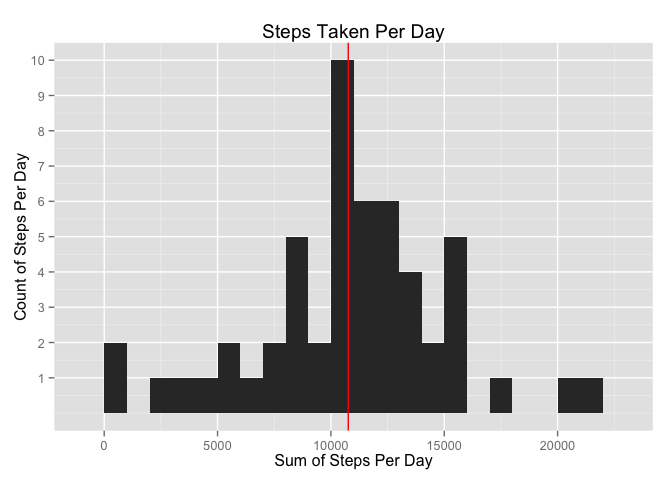
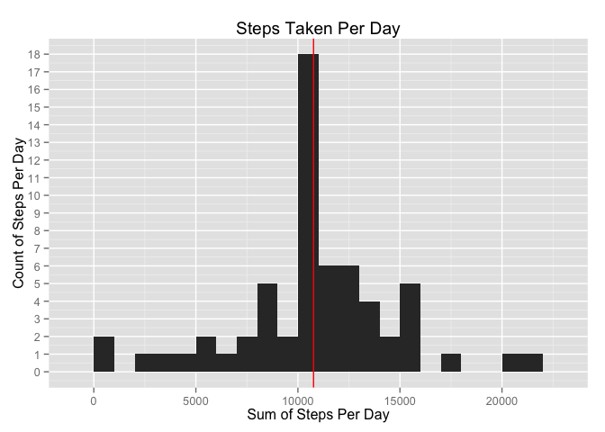
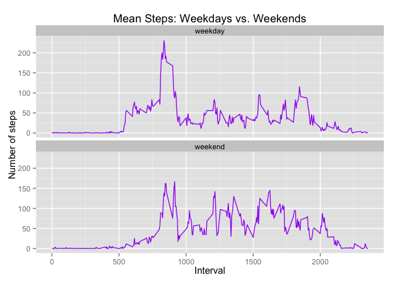

# Reproducible Research: Peer Assessment 1


## Loading and preprocessing the data

```r
dat <- read.csv("activity.csv")
str(dat)
```

```
## 'data.frame':	17568 obs. of  3 variables:
##  $ steps   : int  NA NA NA NA NA NA NA NA NA NA ...
##  $ date    : Factor w/ 61 levels "2012-10-01","2012-10-02",..: 1 1 1 1 1 1 1 1 1 1 ...
##  $ interval: int  0 5 10 15 20 25 30 35 40 45 ...
```
The data contains many NA records and the date column is not the correct class. The NA records will be dealt with throughout the analysis, but the date column must be reclassified now.


```r
dat$date <- as.Date(dat$date)
```

## What is mean total number of steps taken per day?

```r
# Aggregate by date
dsteps <- aggregate(dat$steps, list(date = dat$date), sum)
names(dsteps) <- c("date","steps")
# Summary Statistics
mu <- mean(dsteps$steps, na.rm = TRUE)
median <- median(dsteps$steps, na.rm = TRUE)

# Histogram
ggplot(dsteps, aes(x = steps)) + 
  geom_histogram(binwidth = 1000) + 
  scale_y_continuous(breaks = seq(1, 10)) +
  labs(title="Steps Taken Per Day", x="Sum of Steps Per Day", y="Count of Steps Per Day") +
  geom_vline(xintercept = mu, color = "red") 
```

 

The mean number of steps taken per day is 10766.19 and the median is 10765. The distribution of the sum of steps appears to be mound shaped. By measure of strictly visual inspection the distribution appears normal in nature, although technical analysis is required to substantiate this notion.

## What is the average daily activity pattern?

```r
# Aggregate by interval
dinterval <- aggregate(dat$steps[!is.na(dat$steps)], list(interval = dat$interval[!is.na(dat$steps)]), mean)
names(dinterval) <- c("interval", "steps")

# Line plot
ggplot(dinterval, aes(x = interval, y = steps)) +
    geom_line()
```

 

We see a clear average spike in average steps per day somewhere between the 750-1000 interveral range. The maximum mean steps per interval is calculated below:

```r
dinterval[which.max(dinterval$steps),]
```

```
##     interval    steps
## 104      835 206.1698
```

## Imputing missing values
The total number of missing values can be discovered by summing the results of `is.na()`.

```r
sum(is.na(dat$steps))
```

```
## [1] 2304
```

To replace these 2304 missing values we can write a function `dat_replace_missing`. This will be a specialized function unique to the needs for this particular data set. We'll use the interval mean average as a replacement value for records with `NA` steps.

```r
dat_replace_missing <- function() {
  dat_temp <- dat
  # Loops through records in temp data frame
  for(i in 1:nrow(dat_temp))
  {
    # If steps is NA, replace it with the corresponding interval mean steps
    if(is.na(dat_temp$steps[i]))
    {
      dat_temp$steps[i] <- dinterval$steps[dinterval$interval == dat_temp$interval[i]]
    }
  }
  dat_temp
}

dat_na_removed <- dat_replace_missing()
```

At this point `dat_na_removed` is identical to `dat` except that `NA` steps records have been replaced. Using methods already described above, we can calculate the average steps per day, mean and median values for this new data set.

 

Despite approximately 13% of the records having been replaced, the distribution looks essentially identical. This is reflected in the mean and median values of 10766.19. The most noticable difference between the data sets is the median value which has converged upon the mean. This is not entirely unexpected since afterall it was the mean interval values that we used to replace the data.

## Are there differences in activity patterns between weekdays and weekends?

A new column will be added to `dat_na_removed` that specifies the day of the week.


```r
dat_weekdays <- function() {
  # Create vector of weekday / weekend
  days_vector <- sapply(dat_na_removed$date, weekdays)
  days_vector <- days_vector %in% c("Saturday", "Sunday")
  days_vector <- sapply(days_vector, function(x) if(x) { "weekend" } else { "weekday" })
  
  # Bind dat_na_removed to above vector. 
  dat_temp <- cbind(dat_na_removed, days_vector)
  names(dat_temp) <- c(names(dat_na_removed), "weekday")
  
  dat_temp
}

dat_days <- dat_weekdays()
```

Below is a panel plot and summary statistics comparing the interval averages between weekdays and weekends.

```r
# Aggregate steps by interval and weekday 
dat_days_date <- aggregate(steps ~ interval + weekday, data=dat_days, mean)
names(dat_days_date) <- c("interval", "weekday", "steps")
```


```r
# Panel Plot - from interval and weekday aggregation of dat_days
ggplot(dat_days_date, aes(x = interval, y = steps)) +
  geom_line(color="purple") +
  facet_wrap(~ weekday, nrow = 2, ncol =1) + 
  labs(x = "Interval", y = "Number of steps", title = "Mean Steps: Weekdays vs. Weekends")
```

 

```r
# Summary table using the psych library
describeBy(dat_days$steps, dat_days$weekday)
```

```
## group: weekday
##   vars     n  mean     sd median trimmed mad min max range skew kurtosis
## 1    1 12960 35.61 104.22      0   10.06   0   0 806   806 4.57    22.77
##     se
## 1 0.92
## -------------------------------------------------------- 
## group: weekend
##   vars    n  mean     sd median trimmed mad min max range skew kurtosis
## 1    1 4608 42.37 108.23      0   14.12   0   0 785   785 3.86    16.17
##     se
## 1 1.59
```

The weekend has higher average steps cross all intervals. The max steps occurs during weekdays, and subsequently weekdays have a wider range. The kurtosis of weekend steps -- a measure of how close the distribution hugs the mean -- is smaller, indicating that on average weekday intervals cluster comparateively closer about their higher mean value.
